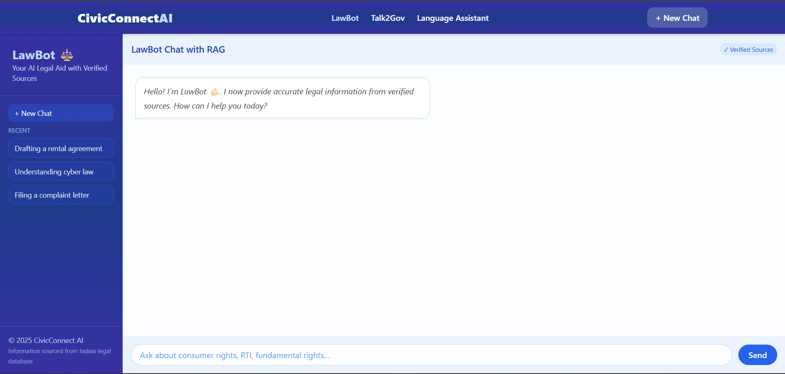
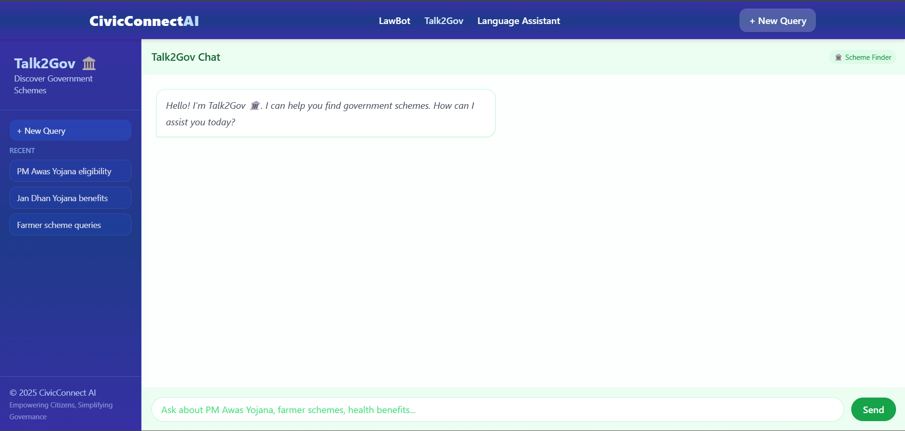
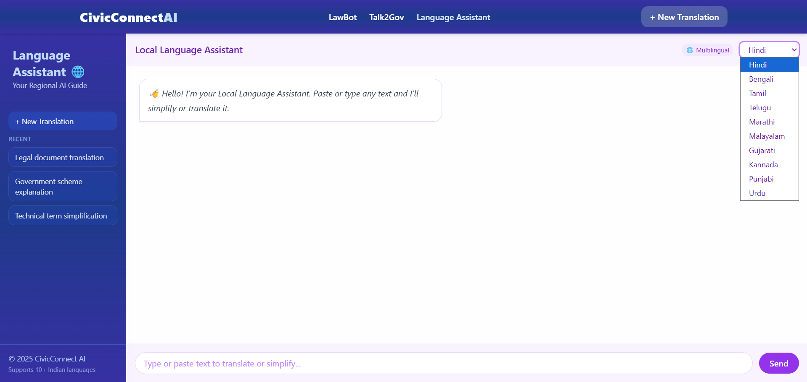
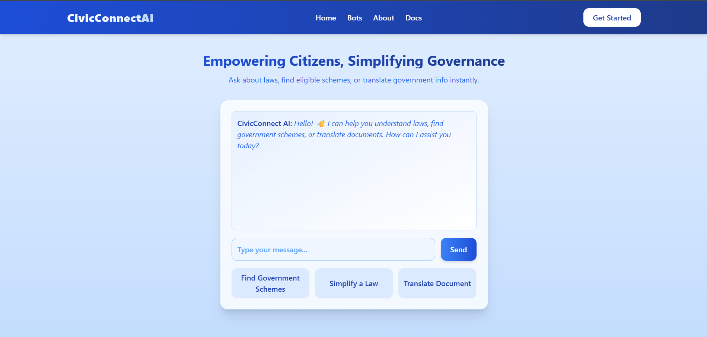

# 🏛️ CivicConnect AI  
**Empowering Citizens, Simplifying Governance**


CivicConnect AI is an **AI-powered citizen assistance platform** that helps users easily access **legal information**, **government schemes**, and **community resources** — all in their **local language**.  

Built with **React + Tailwind CSS** and powered by **Google Gemini AI**, it provides a unified, conversational experience that makes civic processes simple, transparent, and accessible for everyone.


---

## 🌍 Vision

> “Every citizen deserves clarity, access, and empowerment — no matter their language or background.”

CivicConnect AI bridges the gap between **citizens and governance** through intelligent, multilingual, and empathetic assistance.

---

## 🧠 Core AI Modules

### 1. ⚖️ **LawBot – AI Legal Aid**
> “Your friendly legal assistant.”



- Explains laws and legal rights in plain, easy-to-understand language  
- Helps users draft **basic legal documents** (complaints, agreements, etc.)  
- Educates citizens on legal processes (non-advisory)  
- Uses verified, public legal sources for factual accuracy  

---

### 2. 🏛️ **Talk2Gov – Scheme Finder**
> “Discover schemes that match your life.”



- Helps users find **government schemes** based on inputs like age, occupation, and needs  
- Guides through **eligibility**, **document requirements**, and **application steps**  
- Uses Gemini’s reasoning to summarize government policies clearly  
- Simplifies the discovery of central and state programs  

---

### 3. 🌐 **Local Language Assistant**
> “Civic help in your own language.”



- Detects the user’s **preferred language** automatically  
- Translates and simplifies content into **regional languages** (Hindi, Tamil, Bengali, etc.)  
- Supports **both text and voice interaction**  
- Prioritizes readability and cultural accuracy in translation  

---

### 4. 💬 **Unified Chat Interface**
> “One chat. Every civic need.”



- One conversation for all civic topics — no switching apps or pages  
- Automatically detects user intent (legal, scheme, or language query)  
- Routes queries to the right AI module dynamically  
- Maintains context and offers continuous, smooth dialogue  

---

### 5. 🗺️ **(Future) Community Resource Finder**
> “Find local help when you need it.”

- Helps users locate **nearby public resources** such as food banks, clinics, shelters, and NGOs  
- Provides **contact details, directions, and timings**  
- Encourages **community engagement and support**  
- Future integration with **open civic data** for verified listings  

---

## 🎨 UI & Design

Built using **Tailwind CSS** for a clean, accessible, and mobile-first design.  

**Tailwind Highlights:**
- Utility-first design with flex, grid, and gap for structure  
- `rounded-2xl` and `shadow-lg` for modern UI cards  
- `bg-gradient-to-r` and `dark:` variants for rich themes  
- Fully responsive across all devices  
- **Framer Motion** animations for smooth UI transitions  

---

## 🧰 Tech Stack

| Layer | Tools / Frameworks |
|-------|--------------------|
| **Frontend** | React.js + Tailwind CSS |
| **AI Engine** | Google Gemini AI |
| **Backend** | Node.js / Express |
| **Language Layer** | Gemini-based multilingual prompt handling |
| **Future Integration** | Community data APIs, Maps API |

---

## ✅ 5-Day Completion Summary

Over **5 intensive days**, we built and integrated multiple AI-powered civic modules under a unified React + Express setup.  
Here’s what we accomplished:

### 🗓️ **Day 1 – Project Setup & Planning**
- Initialized full-stack project structure (`backend` + `frontend`)
- Configured **Express server**, **CORS**, and **dotenv**
- Set up environment variables and basic API route handling  
- Planned UI layout and component hierarchy in React

### ⚖️ **Day 2 – LawBot (AI Legal Assistant)**
- Created `lawbotController.js`, `lawbotRoutes.js`, and `laws.json` under `backend/`
- Integrated **Gemini AI** for legal query responses (`aiService.js`)
- Designed `LawBotPage.jsx` with conversational chat UI
- Added Markdown rendering for formatted AI output  
- Implemented backend–frontend connectivity using **Axios**

### 🏛️ **Day 3 – Talk2Gov (Scheme Finder)**
- Developed `Talk2GovPage.jsx` with structured chat support  
- Integrated `ragService.js` for **retrieval-augmented generation (RAG)** to summarize government schemes  
- Set up JSON dataset for schemes and responses
- Enabled backend routing logic for Talk2Gov module  

### 🌐 **Day 4 – Local Language Assistant**
- Implemented automatic **language detection** and translation using Gemini  
- Created `LanguageAssistantPage.jsx` with multilingual chat interface  
- Improved error handling for JSON parsing and translation edge cases  
- Fine-tuned prompt structures in `promptManager.js`

### 💬 **Day 5 – UI, Navigation & Final Integration**
- Designed reusable components:  
  - `FeatureNavbar.jsx`, `Sidebar.jsx`, `Navbar.jsx`, `Header.jsx`, `Footer.jsx`  
- Integrated **Framer Motion** animations for transitions  
- Applied **Tailwind CSS** with responsive, modern styling  
- Unified all AI modules under a consistent layout  
- Finalized documentation and project branding as **CivicConnect AI**

---


## 🚀 Next Steps & Future Enhancements

### 🔗 **1. Unified Chat Experience**
- Merge all individual AI assistants (LawBot, Talk2Gov, Language Assistant) into a **single smart conversation** that automatically routes queries.

### 🧭 **2. Community Resource Finder**
- Integrate **real-time civic resource data** (clinics, NGOs, food banks) using open datasets and Maps API.

### 🗣️ **3. Voice Interaction**
- Add **speech-to-text and text-to-speech** capabilities for fully hands-free assistance.

### 🧾 **4. User Dashboard**
- Enable users to **save chats**, **bookmark responses**, and **view history**.

### ⚙️ **5. Deployment & Scalability**
- Deployment Link - https://civicconnectaiweb.netlify.app/
- Dockerize backend and frontend for easy deployment  
- Add CI/CD workflows for production build  
- Optimize for mobile-first performance

---

## 🔌 Backend API Endpoints

The backend is powered by **Node.js + Express**, exposing RESTful endpoints for each AI module.

### 🧠 Base URL
http://localhost:8080/api


---

### ⚖️ **LawBot – AI Legal Aid**
| Method | Endpoint | Description |
|--------|-----------|--------------|
| `POST` | `/api/lawbot` | Handles user queries related to laws and rights. |
| `POST` | `/api/lawbot/rag` | Enhanced RAG-based (Retrieval-Augmented Generation) legal response. |
| `GET` | `/api/lawbot/laws` | Fetches all available law documents for reference or debugging. |

---

### 🏛️ **Talk2Gov – Scheme Finder**
| Method | Endpoint | Description |
|--------|-----------|--------------|
| `POST` | `/api/talk2gov` | Returns summarized and AI-interpreted government schemes based on user input. |

---

### 🌐 **Local Language Assistant**
| Method | Endpoint | Description |
|--------|-----------|--------------|
| `POST` | `/api/translate` | Detects and translates user input into preferred regional language. |

---

### 💬 **Unified Chat**
| Method | Endpoint | Description |
|--------|-----------|--------------|
| `POST` | `/api/chat` | Smart unified endpoint that routes queries dynamically (LawBot, Talk2Gov, or Language Assistant). |

---

### ⚙️ **CORS Configuration**
The backend allows requests only from the local frontend:


---

## ⚙️ Installation & Setup

### 📦 Prerequisites
- Node.js (v18 or above)
- npm or yarn package manager
- Google Gemini API access key (for local AI interaction)

### 🚀 Setup Instructions
```bash
# 1. Clone the repository
git clone https://github.com/claudiajerome07/GenAI-Bootcamp.git
cd GenAI-Bootcamp

# 2. Install dependencies
npm install

# 3. Start development server
npm run dev

# 4. Build for production
npm run build
```


## 👥 Contributors

| Contributor | GitHub |
|-------------|--------|
| Claudia Jerome | [claudiajerome07](https://github.com/claudiajerome07) |
| R John Robert | [JoRobert137](https://github.com/JoRobert137) |
| Jeslin M  | [jeslinms111-cmyk](https://github.com/jeslinms111-cmyk) |
| Tanya A | [Tanya-2408](https://github.com/Tanya-2408) |
| Antony Felvyn | [antonyfelvyns111-afk](https://github.com/antonyfelvyns111-afk) |

> Thanks to all our amazing contributors! 🚀


<p align="center">
  <a href="https://github.com/claudiajerome07/GenAI-Bootcamp/graphs/contributors">
    
  </a>
</p>

<p align="center">CodeZ ❤️</p>
